# 📈 Stock Price Forecasting

**Final Project — DBAS3090: Applied Data Analytics**  
**Institution**: Nova Scotia Community College (NSCC)  
**Program**: IT – Data Analytics  
**Course**: Applied Data Analytics  
**Instructor**: George Campanis  
**Term**: Winter 2025  

---

## 📌 Project Overview

This repository contains the final project developed for the **Applied Data Analytics** course at NSCC. The objective was to automate the daily download of stock market data and build a Machine Learning model capable of predicting the next day's stock price.

The goal was not to optimize model performance, but rather to apply core **Machine Learning** concepts in a practical scenario. The final solution was designed to be **automated** and **reusable in real time** through an **interactive dashboard in Power BI**.

---

## 🎯 Project Objectives

- Automate the daily retrieval of financial market data
- Build a predictive ML model for daily stock price forecasting
- Visualize predictions and trends in an interactive dashboard
- Apply end-to-end data analytics: from data ingestion to deployment

---

## 🧪 Selected Stocks & Indicators

- **Companies**: Meta, Tesla, Google, Amazon
- **Context**: Trends after Donald Trump’s inauguration
- **Additional Data**:
  - S&P 500
  - Nasdaq
  - USD (US Dollar)

---

## 🛠️ Technical Summary

| Area           | Tools / Techniques                                                                 |
|----------------|--------------------------------------------------------------------------------------|
| **Language**   | R                                                                                   |
| **Libraries**  | `tidyquant`, `quantmod` (data collection) `DBI`, `odbc` (database access) `caret` (modeling) |
| **Database**   | SQL Server                                                                          |
| **Automation** | SQL Server Job Agent                                                                |
| **Models**     | Random Forest, XGBoost                                                              |
| **Final Model**| XGBoost Regression                                                                  |
| **Visualization** | Power BI + R                                                                     |
| **Artifacts**  | ERD, DFD, Data Dictionary, DDL scripts                                              |

---

## 📊 Dashboard & Insights

The final Power BI dashboard displays:

- Historical and predicted prices
- Model performance metrics
- Comparative stock analysis
- Economic indicators impact

> A screenshot of the dashboard can be found in the `images/` folder. *(Add one if available.)*

---

## 📊 Dashboard Overview

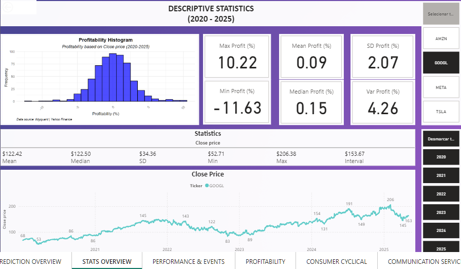
  
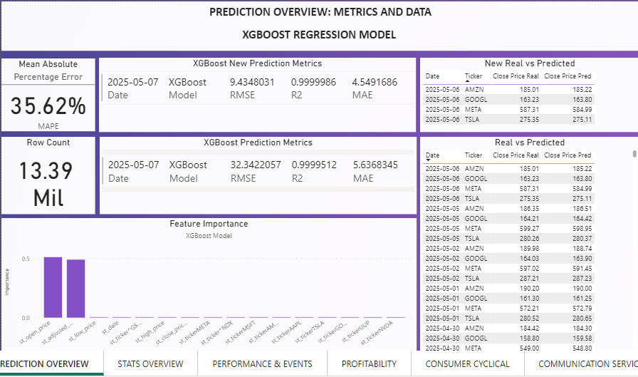
  
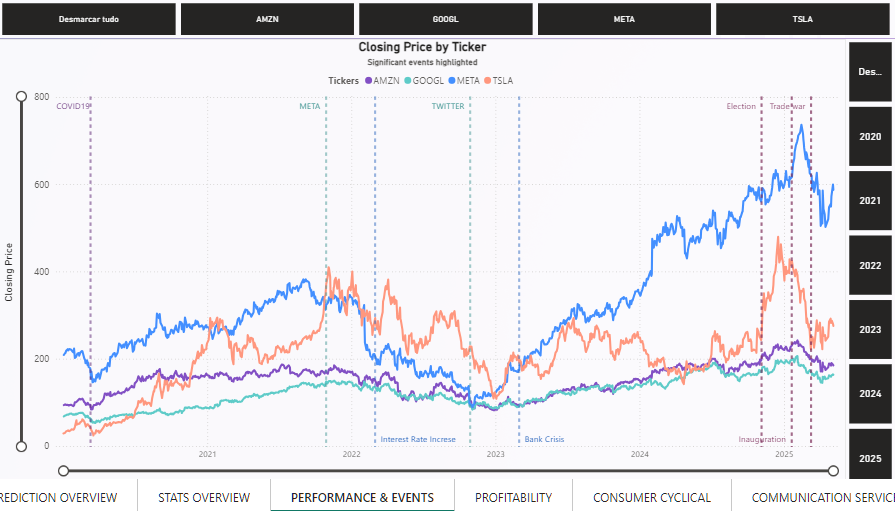
  
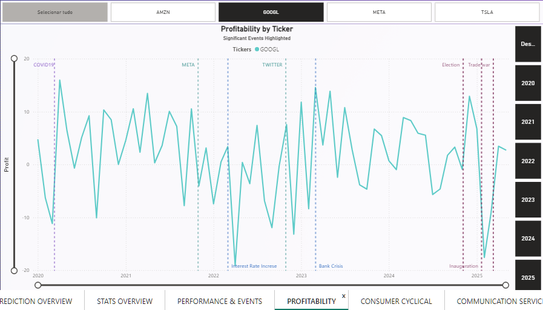
  

  
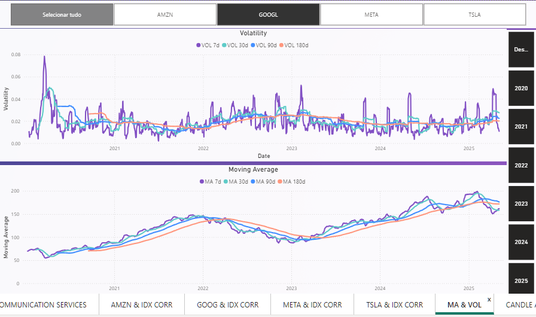
  
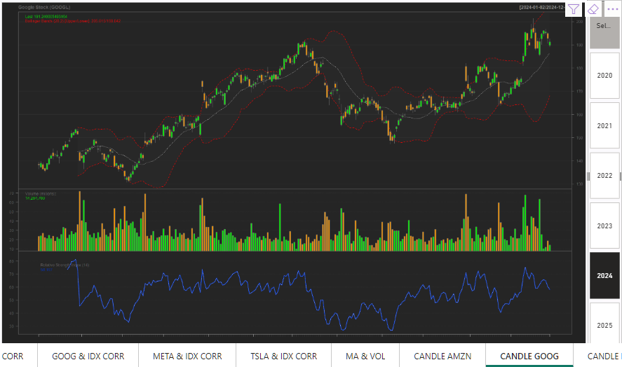
  

  
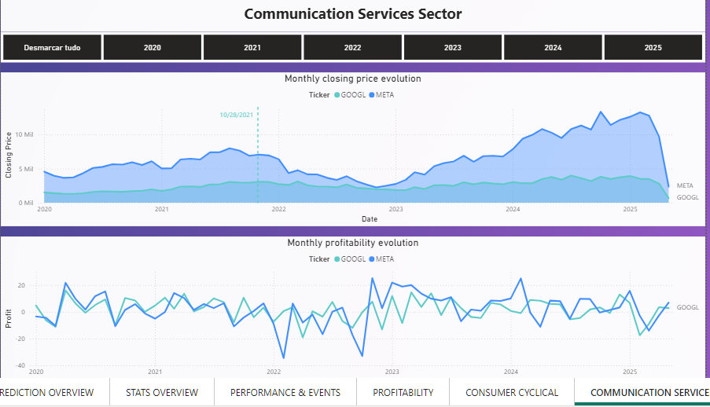
  

---

## 📊 Importing Machine Learning Model into Power BI

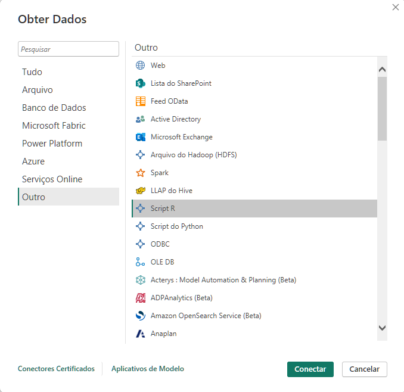
  
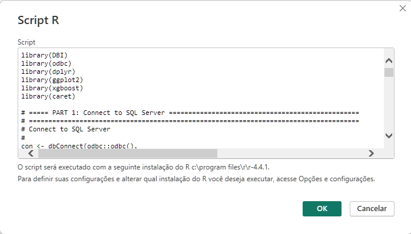
  
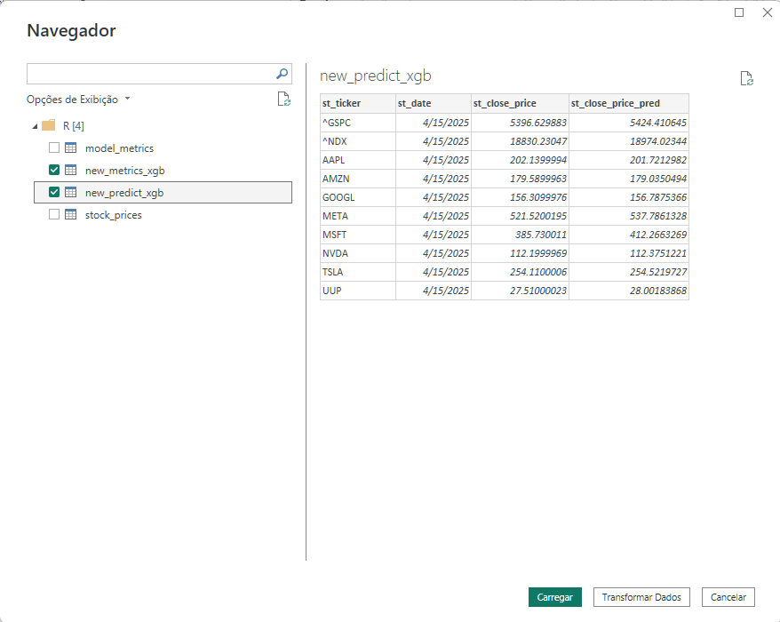
  
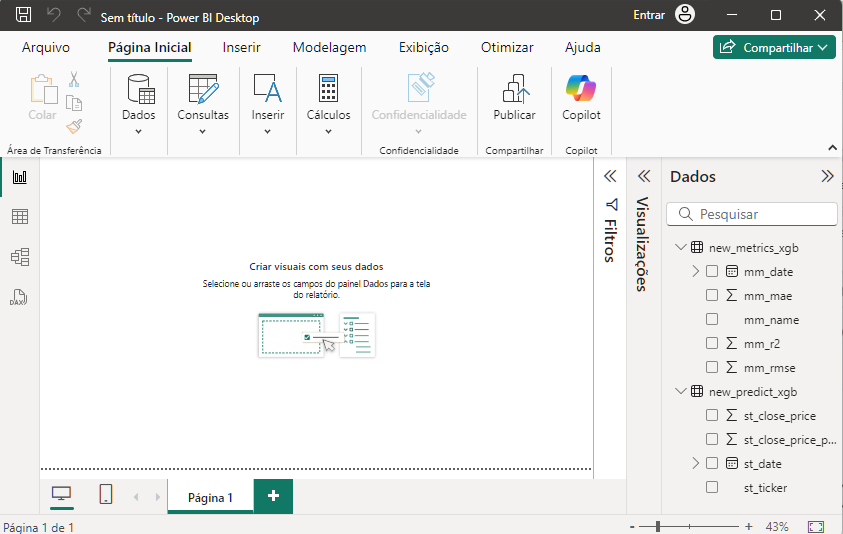
  

---

## 🧠 Related Work

In a separate project for the **Intro to Machine Learning** course, I reused this data model to train a **Neural Network** using **RStudio**, **R**, **Python**, **TensorFlow**, and **Keras**, forecasting **Microsoft's** stock price.

---

## Acknowledgments
Special thanks to **George Campanis** for guidance throughout the course.

